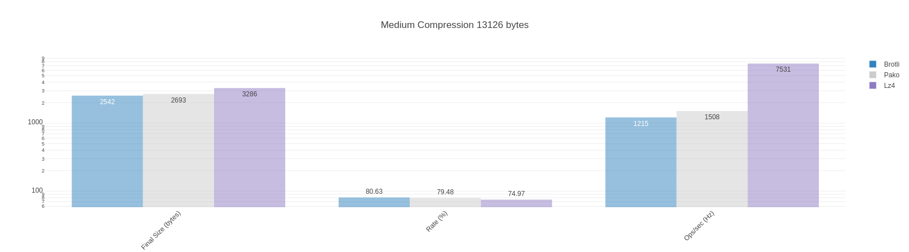
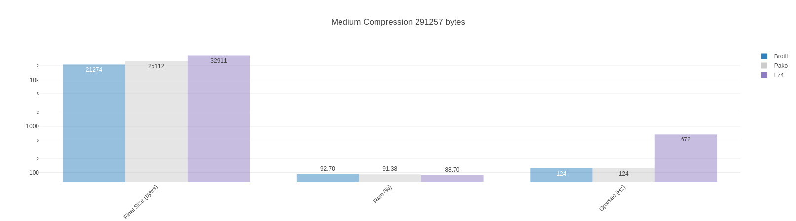
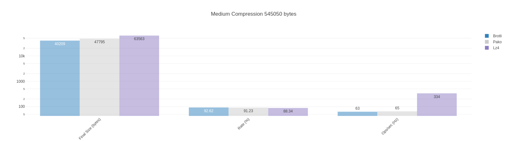

# Material Data Compression Benchmark

Suite of material data compression benchmarks based on the [fake material data](https://github.com/dstanesc/fake-material-data) library.

Currently tested libraries: `brotli`, `pako` and `lz4js`.

## Dependencies

```sh
$ node --version
v16.13.1

$ npm --version
8.1.2
```

## Execute Benchmark

```sh
npm run clean
npm install
npm start
```

## Typical Material Results

Eg. Generated material w/ 500 properties
```
Compression and decompression combined size 290890 bytes, brotli {"quality":1} compressed size 24170 bytes, compression rate 91.69 %
Compression and decompression combined size 290890 bytes, pako {"level":1} compressed size 29428 bytes, compression rate 89.88 %
Compression and decompression combined size 290890 bytes, lz4 (default) compressed size 33000 bytes, compression rate 88.66 %
Brotli x 116 ops/sec ±2.49% (66 runs sampled)
Pako x 149 ops/sec ±2.55% (77 runs sampled)
Lz4js x 345 ops/sec ±2.19% (71 runs sampled)
The fastest option is Lz4js

Compression and decompression combined size 290890 bytes, brotli {"quality":5} compressed size 21517 bytes, compression rate 92.60 %
Compression and decompression combined size 290890 bytes, pako {"level":5} compressed size 25228 bytes, compression rate 91.33 %
Compression and decompression combined size 290890 bytes, lz4 (default) compressed size 33000 bytes, compression rate 88.66 %
Brotli x 80.19 ops/sec ±2.39% (68 runs sampled)
Pako x 105 ops/sec ±1.39% (76 runs sampled)
Lz4js x 336 ops/sec ±2.54% (74 runs sampled)
The fastest option is Lz4js

Compression and decompression combined size 290890 bytes, brotli {"quality":11} compressed size 18816 bytes, compression rate 93.53 %
Compression and decompression combined size 290890 bytes, pako {"level":9} compressed size 24382 bytes, compression rate 91.62 %
Compression and decompression combined size 290890 bytes, lz4 (default) compressed size 33000 bytes, compression rate 88.66 %
Brotli x 1.82 ops/sec ±3.89% (9 runs sampled)
Pako x 88.48 ops/sec ±1.20% (74 runs sampled)
Lz4js x 325 ops/sec ±1.99% (81 runs sampled)
The fastest option is Lz4js

```
20 Properties



100 Properties


500 Properties



1000 Properties



